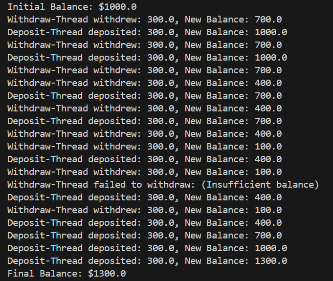
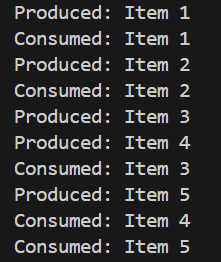
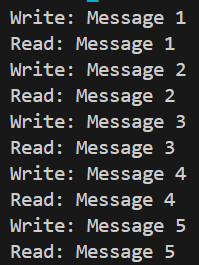
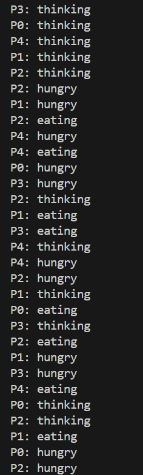
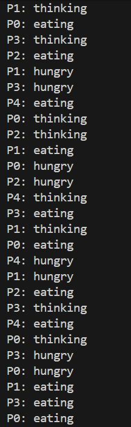

## Lab Overview

The purpose of this lab is to deepen your understanding of multithreading and concurrency in Java through practical implementation of various concepts.

### Task 1: Implement a Thread-Safe Bank Account

**Description:** Create a BankAccount class that supports concurrent deposits and withdrawals without race conditions.

**How to run:**
1. Clone this git repository
2. Open this directory in your IDE
3. Run the file ```BankDemo.java``` in folder  ```Task1```

**Output:**  


### Task 2: Producer-Consumer with Bounded Buffer

**Description:** Implement a producer-consumer system where producers add items to a bounded buffer and consumers
remove them

**How to run:**
1. Clone this git repository
2. Open this directory in your IDE
3. Run the file ```ProducerConsumer.java``` in folder  ```Task2```

**Output:**  


### Task 3: Reader-Writer Problem

**Description:** Implement a solution where multiple readers can access a resource simultaneously, but writers need exclusive
access

**How to run:**
1. Clone this git repository
2. Open this directory in your IDE
3. Run the file ```WriterReader.java``` in folder  ```Task3```

**Output:**  


### Task 4: Dining Philosophers Problem

**Description:** Implement the classic Dining Philosophers problem:
5 philosophers sitting around a circular table
5 forks (one between each pair of philosophers)
Each philosopher alternates between thinking and eating
To eat, a philosopher needs both left and right forks
Prevent deadlock and starvation

**Requirements:**
Each philosopher should eat at least 3 times
Use proper synchronization to avoid deadlock
Display philosopher states (thinking/hungry/eating)
Implement timeout mechanism to break potential deadlocks
Run simulation for 2 minutes and show statistics

**How to run:**
1. Clone this git repository
2. Open this directory in your IDE
3. Run the file ```DiningDemo.java``` in folder  ```Task4```

**Output:**  

